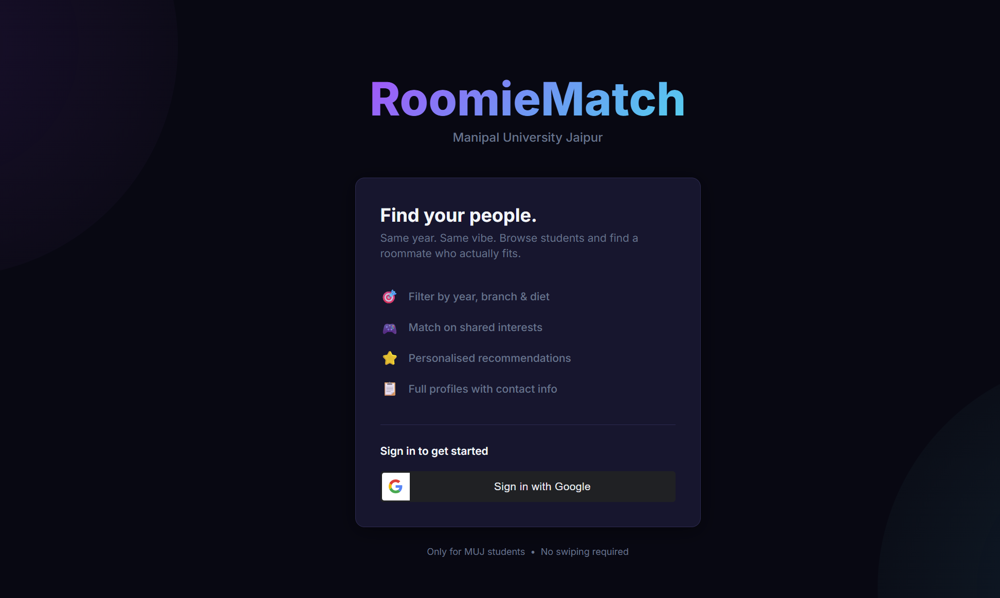
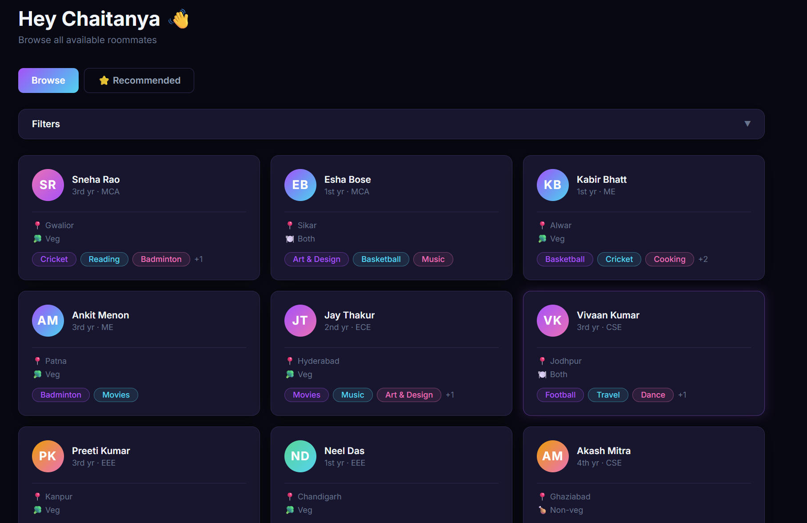
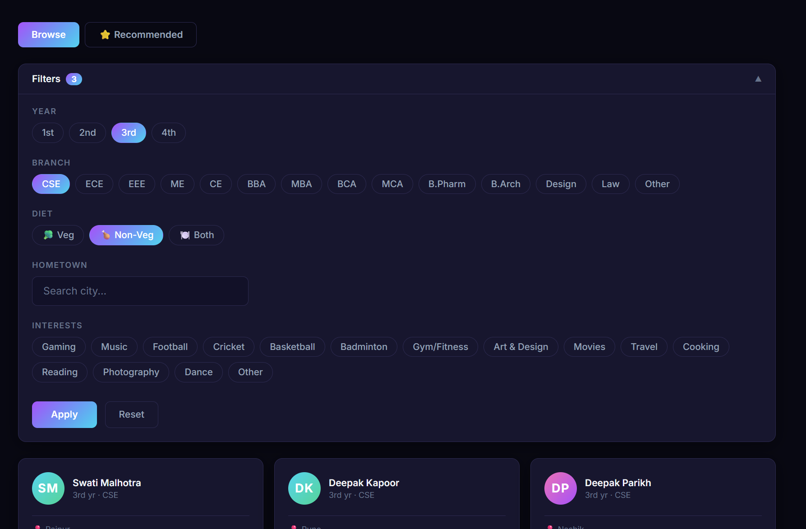
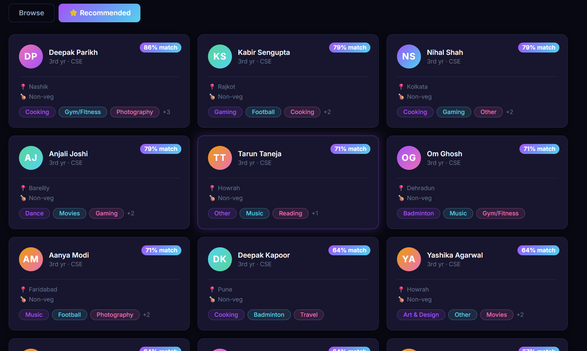
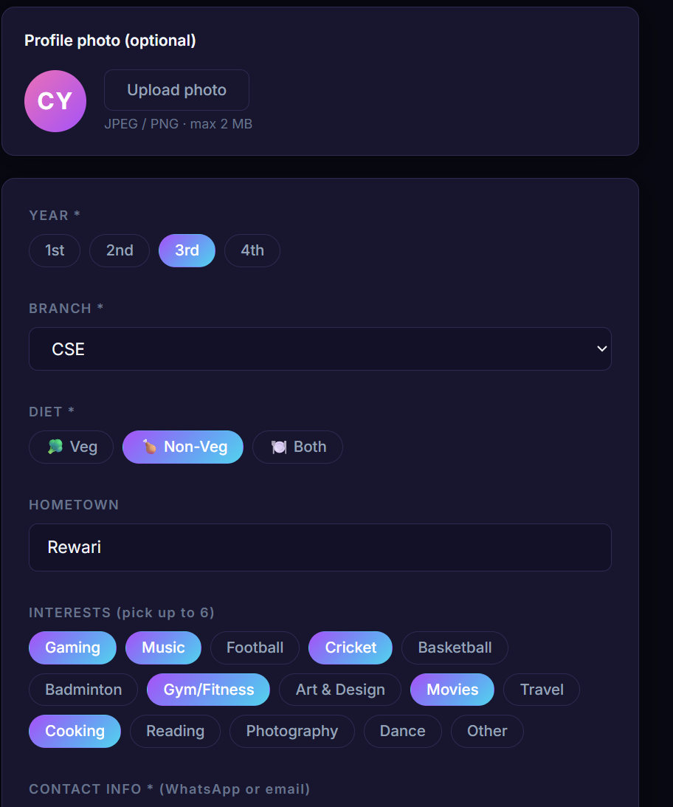

# RoomieMatch — MUJ

> Find a roommate who actually fits. Built for Manipal University Jaipur students.



---

## What is this?

RoomieMatch is a web app for MUJ students to find compatible roommates. Browse profiles, filter by year/branch/diet/interests, and get personalised recommendations — all without swiping.

- No swipes. Just browse and connect.
- 500+ student profiles to explore
- Smart recommendations based on your profile
- Contact info visible directly on every profile

---

## Screenshots

### Login


### Browse


### Filters


### Recommended Tab


### Profile Setup


---

## Tech Stack

| Layer | Tech |
|---|---|
| Frontend | React 18 + Vite + TailwindCSS + TypeScript |
| Backend | FastAPI (Python 3.11) |
| Database | PostgreSQL 15 |
| Auth | Google OAuth 2.0 + JWT |
| ORM | SQLAlchemy (async) + Alembic |
| Dev | Docker Compose |

---

## Features

- **Google Sign-In** — one click, no passwords
- **Profile setup** — year, branch, diet, hometown, interests, contact info
- **Browse** — filterable grid of all looking students
- **Filters** — year, branch, veg/non-veg, hometown, interests
- **Recommended tab** — ranked by compatibility score (shared year, branch, diet, interests, hometown)
- **Profile cards** — full details + contact info on every profile
- **Avatar** — upload a photo or get a gradient initials avatar
- **Looking toggle** — mark yourself as available or not

---

## Running Locally

### Prerequisites
- [Docker Desktop](https://www.docker.com/products/docker-desktop/)
- A Google OAuth Client ID ([how to get one](https://console.cloud.google.com/))

### Setup

**1. Clone the repo**
```bash
git clone https://github.com/chaitanyayad/RoomieMatch.git
cd RoomieMatch
```

**2. Create your `.env` file**
```bash
cp .env.example .env
```
Open `.env` and fill in:
```
GOOGLE_CLIENT_ID=your-google-client-id
SECRET_KEY=any-long-random-string
```

**3. Start everything**
```bash
docker-compose up --build
```

**4. Run the database migration**
```bash
docker-compose exec backend alembic upgrade head
```

**5. Seed 500 fake students**
```bash
docker-compose exec backend python seed.py
```

**6. Open the app**
```
http://localhost:5173
```

---

## Project Structure

```
RoomieMatch/
├── backend/
│   ├── app/
│   │   ├── main.py          # FastAPI app + CORS + static files
│   │   ├── models.py        # SQLAlchemy ORM models
│   │   ├── schemas.py       # Pydantic request/response schemas
│   │   ├── auth.py          # Google OAuth + JWT helpers
│   │   ├── recommender.py   # Compatibility scoring logic
│   │   └── routers/         # auth, users, uploads
│   ├── alembic/             # DB migrations
│   └── seed.py              # 500 fake MUJ students
├── frontend/
│   └── src/
│       ├── pages/           # Landing, Setup, Browse, ProfileCard, MyProfile
│       ├── components/      # ThumbnailCard, A4Card, FilterBar, etc.
│       ├── hooks/           # useAuth
│       └── api/             # axios client with JWT interceptor
├── assets/                  # Screenshots
├── docker-compose.yml
└── .env.example
```

---

## Recommendation Algorithm

Each candidate is scored against your profile:

| Match | Points |
|---|---|
| Same year | +3 |
| Same branch | +3 |
| Same diet preference | +2 |
| Each shared interest (max 5) | +1 each |
| Same hometown | +1 |
| **Max possible** | **14** |

Score is shown as a **% match** badge on each recommended card.

---

## API Endpoints

```
POST  /auth/google           Google token → JWT
GET   /users/me              Own profile
PUT   /users/me              Update profile
GET   /users                 Browse with filters
GET   /users/recommended     Ranked recommendations
GET   /users/{id}            Single profile
POST  /uploads/avatar        Upload avatar image
```

Full interactive docs available at `http://localhost:8000/docs` when running locally.

---

## Future Plans

- Error boundaries + toast notifications
- pytest test suite
- Deployment (Railway + Vercel)

---

## Author

**Chaitanya Yadav** — Manipal University Jaipur

---

*Built with FastAPI, React, PostgreSQL, and Docker.*
